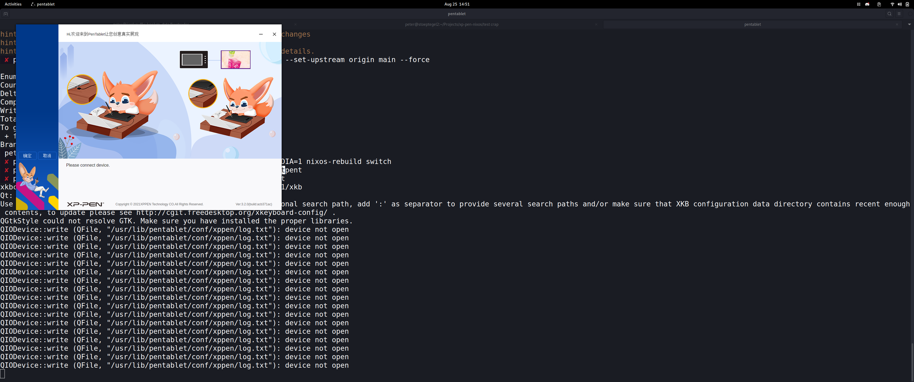

# XP-Pen NixOS Package

This driver can be used in your NixOS installation.

It adds the GUI and the udev rules so you can start right out of the box.

## How to install

- Place `xp_pen_pentablet.nix` inside your `/etc/nixos` folder
- On top of your `configuration.nix`, add:

  ```nix
  xp_pen_pentablet = pkgs.callPackage ./xp_pen_pentablet.nix {};
  ```

  It should look like this:

  ```nix
  { config, pkgs, ... }:
  let
    xp_pen_pentablet = pkgs.callPackage ./xp_pen_pentablet.nix {};
    "";
  in
  {
    imports =
    [
      ./hardware-configuration.nix
    ];
  ...
  }
  ```

- After running `sudo nixos-rebuild switch` you can run 'pentablet' in the terminal to open the GUI.

## Screenshots



## Tested on

- Artist Pro 22E
